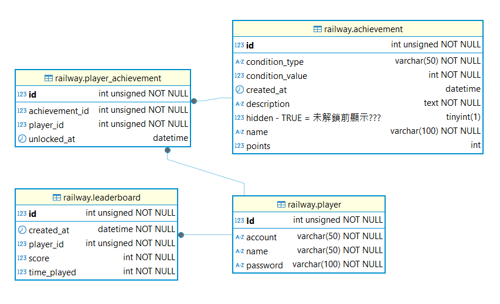

# 🏰 迷宮冒險（Maze Adventure） 

## [遊戲連結](https://mazegame-railway-production.up.railway.app/index.html) (此專案部署於 Railway 免費方案，首次加載可能需等待)
 
## 🌟 專案簡介  
這是一款完整的 **迷宮冒險遊戲專案**，由 **前端 JavaScript 遊戲** 與 **後端 Spring Boot 登錄/排行榜/成就系統** 組成。  

玩家需在 **限時內探索迷宮**，躲避怪物、收集鑽石並到達終點。  
遊戲採 **15x25 的 2D 陣列地圖**，提供 **三張隨機地圖**，並有黑暗視野、提燈與安全屋等機制增加挑戰性。

---

## ⚡ 技術亮點與挑戰

- **怪物 AI**：採用狀態機管理巡邏、追逐、觀察三種模式
  - **追逐模式**：利用 BFS 演算法計算最短路徑追擊玩家
  - **巡邏模式 / 觀察模式**：：怪物隨機移動，但避免走回頭路（除非遇到死路才允許回頭）；在觀察模式會暫停一段時間，玩家脫離視野後再回到巡邏模式
  - **挑戰與解決方案**：
    - 判斷玩家是否進入視野後即時反應
    - 避免怪物卡死、移動錯亂、安全屋堵門口
    - 使用狀態切換來確保 AI 行為穩定
      
- **成就系統**：遊戲勝利後檢查成就條件，成功解鎖後呼叫後端 API 更新資料
  - **隱藏成就**：使用 `HIDDEN` 布林欄位判斷，預設 1 為隱藏，解鎖後改為 0，前端才顯示
  - **挑戰與解決方案**：
    - 前後端同步更新成就狀態，確保遊戲中即時反映
      
- **前端遊戲邏輯模組化**：將遊戲邏輯拆分成多個 JS 模組，依職責分工 
  - **範例模組**：`player.js`（玩家控制）、`monster.js`（怪物 AI）、`grid.js`（地圖生成）、`gameLogic.js`（遊戲邏輯）、`main.js`（主流程控制),etc...

- **JWT 安全驗證機制**
  - 採用 **Access Token + Refresh Token** 雙 Token 架構  
  - **Access Token**：短效（10 分鐘），存於 `sessionStorage`  
  - **Refresh Token**：長效（15 天），存於 **HttpOnly Cookie**，自動刷新 Access Token  
  - **挑戰與解決方案**：  
    - 防止 XSS 竊取 → Refresh Token 存 HttpOnly Cookie  
    - 減少頻繁登入 → Access Token 過期時由 Refresh Token 自動續期  

---

## 🛠 技術架構
- **前端**：JavaScript (遊戲邏輯、視覺呈現)  
- **後端**：Spring Boot (帳號註冊、登入、排行榜、成就管理)  
- **資料庫**：MySQL (存儲玩家帳號、密碼、成就與分數)  
- **前端呈現**：HTML/CSS Grid
- **部署**：Railway (自動化部署與雲端運行)

---
## 🌳 專案結構樹狀圖

```plaintext

.idea/
database/
├── create_table.sql
└── insert_table.sql

springboot-backend/
├── .mvn/wrapper/
├── src/
│   ├── main/
│   │   ├── java/com/miles/maze/mazescape/
│   │   │   ├── config/
│   │   │   ├── controller/
│   │   │   ├── dto/
│   │   │   ├── entity/
│   │   │   ├── repository/
│   │   │   ├── service/
│   │   │   └── MazeGameApplication.java
│   │   └── resources/
│   │       ├── static/
│   │       │   ├── assets/
│   │       │   │   ├── audio/
│   │       │   │   ├── css/
│   │       │   │   ├── font_style/
│   │       │   │   ├── images/
│   │       │   │   └── js/
│   │       │   ├── Level_1.html
│   │       │   ├── achievements.html
│   │       │   ├── index.html
│   │       │   ├── instructions.html
│   │       │   └── leaderboard.html
│   │       └── application.properties
│   └── test/java/com/miles/maze/mazescape/
├── .gitattributes
├── .gitignore
├── mvnw
├── mvnw.cmd
├── pom.xml
└── Dockerfile
```

---

## 📄 資料庫設計 ERD 圖



---

## 🎮 遊戲操作
- **W**：向上移動  
- **A**：向左移動  
- **S**：向下移動  
- **D**：向右移動  
- **F**：使用提燈，點亮周遭 8 格  

---

## 📜 遊戲規則
- **遊戲時間**：總共 **100 秒**  
- **前 10 秒倒數**：地圖全亮，但玩家無法移動  
- **黑暗探索**：倒數結束後，地圖被黑霧覆蓋，玩家需靠記憶探索  
- **坑洞**：踩到無法通行的格子會 **回到起點**  
- **安全屋**：
  - 地圖上有 **三間安全屋**  
  - 進入安全屋可 **暫停時間 3 秒**，並短暫亮起整張地圖  
  - 若三間安全屋都進過，玩家將獲得 **全亮視野**  
- **鑽石**：地圖上有 **四顆鑽石**，每顆加 **1500 分**  

---

## 👹 怪物設定
迷宮中共有 **三隻怪物**，各自有不同速度、視野與行為模式：

- **巡邏怪物 鬼魂**
  - **速度較慢**  
  - **視野範圍較大**  
  - **行為模式**：
    - **巡邏模式**：隨機移動，但不走回頭路（除非無路可走）  
    - **追逐模式**：當玩家進入視野範圍時，立即追擊  
    - **觀察模式**：玩家脫離視野後，停 **1 秒** 過渡，再回到巡邏  

- **巡邏怪物 樹妖**
  - **速度稍快**  
  - **視野範圍較小**  
  - **行為模式**：
    - **巡邏模式**：隨機移動，不走回頭路（除非無路可走）  
    - **追逐模式**：當玩家進入視野範圍時，立即追擊  
    - **觀察模式**：玩家脫離視野後，停 **1 秒** 過渡，再回到巡邏  

- **終點守衛怪物 食人魔**
  - 只在 **終點前 6x6 區域巡邏**  
  - **速度最快**  
  - **行為模式**：
    - **守衛模式**：只在終點 6x6 區域內巡邏，不離開  
    - **追逐模式**：玩家踏入守衛區域立即追擊  

---

## 💯 分數計算
- **剩餘時間**：50 分  
- **鑽石收集**：每顆 1500 分  
- **使用提燈**：500 分  

> **最終分數 = 剩餘時間分 + 鑽石分 + 提燈分**  

- **排行榜**：
  - 已登入玩家分數會紀錄於排行榜  
  - 未登入玩家分數僅計算，不會紀錄  

---

## 🔐 帳號與排行榜 (Spring Boot)
- 玩家可 **註冊帳號、登入並遊玩迷宮遊戲**  
- 登錄後的分數會 **自動儲存至排行榜**  
- 未登入玩家仍可遊玩，但分數不會紀錄  
- 技術：
  - 後端：Spring Boot  
  - 資料庫：MySQL  
  - API 提供登入/註冊/排行榜資料  

---

## 🏆 迷宮遊戲成就

-  **平安離開**：首次通關 
-  **完美主義**：全程無失誤 
-  **尋寶者**：收集 4 顆鑽石  
-  **快還要更快**：30 秒內通關
-  **活著真好**：玩家成功通關所有地圖
-  **???**：??????????????

- **成就系統**：
  - 已登入玩家才解鎖記錄成就 

---

## 🎯 遊戲目標
- 在 **限時內到達終點**  
- 收集盡可能多的鑽石  
- 善用安全屋與提燈，避免被怪物追上  
- 避免踩到坑洞回到起點  

---

## ✨ 遊戲特色
- **三張隨機迷宮地圖**，增加重玩性  
- **黑暗與提燈機制**，考驗玩家記憶力  
- **不同速度與視野的怪物**，提升策略挑戰  
- **安全屋暫停與全亮視野**，提供策略規劃空間  
- **分數排行榜**，增加競技性
- - **成就**，完成特定條件可解鎖，增加成就感與探索樂趣  
- **前後端完整整合**：遊戲 + 帳號系統 + 排行榜  

---

## 📂 額外資源
- **專題簡報（PTT）**：可參考完整設計流程與遊戲展示  
  [PTT 連結](https://docs.google.com/presentation/d/1cIaDvqBhOn4fX0DAhQn4DmUXwgNBJUsQ-qf8kLMgzDM/edit?usp=sharing)

